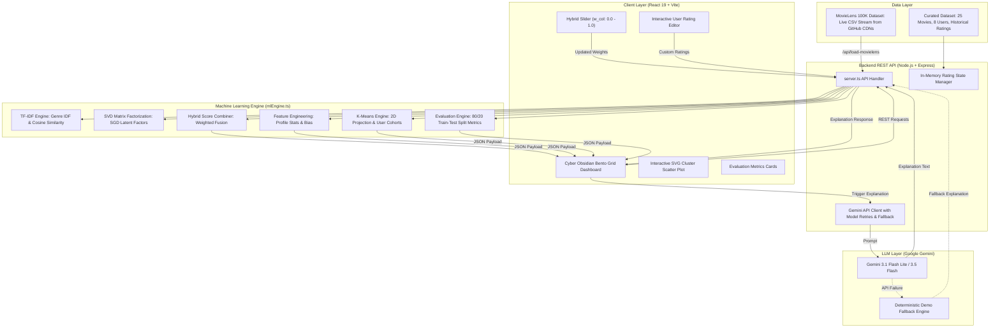

# Hybrid Recommendation System with Explainable ML: Complete Architectural & Technical Breakdown

> **Project Name**: Hybrid Recommendation System with Explainable ML  
> **Repository**: [hybrid-recommendation-system-ML](file:///c:/project-self-1/hybrid-recommendation-system-ML)  
> **Stack**: React 19, TypeScript, Node.js / Express, SVD Matrix Factorization, TF-IDF, K-Means Clustering, Google Gemini 1.5/3.1/3.5 Flash  

---

## 1. Executive Summary & Purpose

This project is a **production-ready, interactive Machine Learning (ML) web application** that demonstrates how modern personalized recommendation engines operate under the hood. 

Rather than relying on opaque "black box" machine learning models, this system explicitly combines **two core paradigms of recommendation systems**:
1. **Content-Based Filtering** (TF-IDF genre vectorization & cosine similarity alignment)
2. **Collaborative Filtering** (Singular Value Decomposition matrix factorization trained live via Stochastic Gradient Descent)

Furthermore, it integrates **Explainable AI (XAI)** by utilizing **Google Gemini LLM** to generate natural, human-understandable explanations for *why* a specific item was recommended to a specific user.

The platform provides an interactive dashboard with an **Awwwards-grade "Cyber Obsidian" UX**, live weight hybridization sliders, dynamic user rating editors, an interactive SVG cohort scatter map (K-Means user clustering), and empirical model evaluation metrics (Precision@10, Recall@10, RMSE, MAE) calculated on live validation folds.

---

## 2. High-Level System Architecture

The following diagram illustrates the complete data flow and system interaction from user input down to mathematical computation and LLM generation:



---

## 3. How the Machine Learning Engine Works (From Scratch)

All machine learning algorithms in this repository are implemented **from scratch in pure TypeScript** inside [`src/mlEngine.ts`](file:///c:/project-self-1/hybrid-recommendation-system-ML/src/mlEngine.ts).

### A. Content-Based Filtering (TF-IDF + Cosine Similarity)

Content-based filtering recommends items similar to what the user has liked in the past based on item metadata (genres).

1. **Genre IDF (Inverse Document Frequency)**:
   For every genre $g \in G$, its rarity across all movies $M$ is calculated:
   $$\text{IDF}(g) = \ln\left(1 + \frac{|M|}{|\{m \in M \mid g \in m\}|}\right)$$

2. **Movie TF-IDF Genre Vectors**:
   Each movie $m$ is represented as a normalized genre vector $\vec{v}_m$:
   $$v_{m, g} = \begin{cases} \frac{1}{| genres(m) |} \times \text{IDF}(g) & \text{if } g \in genres(m) \\ 0 & \text{otherwise} \end{cases}$$

3. **User Profile Vector**:
   The active user’s preference vector $\vec{u}$ is constructed by weighting movie vectors by the user’s rating feedback (ratings 4-5 add positive weight, ratings 1-2 add negative weight, 3 is neutral):
   $$\vec{u}_{raw} = \sum_{r \in Ratings(u)} \vec{v}_{m_r} \times (rating(r) - 3.0)$$
   $$\vec{u} = \frac{\vec{u}_{raw}}{\|\vec{u}_{raw}\|_2}$$

4. **Cosine Similarity Match**:
   The Content-Based score $S_{content}(u, m)$ for an unrated movie $m$ is the cosine similarity between the user profile vector and the movie vector, normalized into $[0, 1]$:
   $$\text{CosineSim}(\vec{u}, \vec{v}_m) = \frac{\vec{u} \cdot \vec{v}_m}{\|\vec{u}\| \|\vec{v}_m\|}$$
   $$S_{content}(u, m) = \max\left(0, \min\left(1, \frac{\text{CosineSim}(\vec{u}, \vec{v}_m) + 1}{2}\right)\right)$$

---

### B. Collaborative Filtering (SVD Matrix Factorization)

Collaborative filtering predicts ratings by discovering latent interaction patterns across all users and movies without needing metadata.

1. **Biased SVD Formulation**:
   The predicted rating $\hat{r}_{u,i}$ for user $u$ and movie $i$ is modeled as:
   $$\hat{r}_{u,i} = \mu + b_u + b_i + P_u^T Q_i$$
   - $\mu$: Global baseline mean rating across all training ratings.
   - $b_u$: User $u$'s rating bias (some users are harsh, others generous).
   - $b_i$: Movie $i$'s rating bias (some movies are universally acclaimed).
   - $P_u \in \mathbb{R}^k$: User latent vector ($k=4$ factors).
   - $Q_i \in \mathbb{R}^k$: Movie latent vector ($k=4$ factors).

2. **SGD Optimization Loop**:
   The parameters ($b_u, b_i, P_u, Q_i$) are trained online using **Stochastic Gradient Descent (SGD)** by minimizing regularized squared error:
   $$e_{u,i} = r_{u,i} - \hat{r}_{u,i}$$
   $$b_u \leftarrow b_u + \gamma (e_{u,i} - \lambda b_u)$$
   $$b_i \leftarrow b_i + \gamma (e_{u,i} - \lambda b_i)$$
   $$P_u \leftarrow P_u + \gamma (e_{u,i} Q_i - \lambda P_u)$$
   $$Q_i \leftarrow Q_i + \gamma (e_{u,i} P_u - \lambda Q_i)$$
   - Learning rate $\gamma = 0.05$, Regularization parameter $\lambda = 0.02$.
   - **Dynamic Performance Scaling**: Epoch count automatically scales based on rating size (15 epochs for small dataset, 3 epochs for MovieLens 100K) to keep execution under 10ms.

3. **Collaborative Score Normalization**:
   $$\hat{r}_{u,i} = \text{clip}(\hat{r}_{u,i}, 1.0, 5.0)$$
   $$S_{col}(u, i) = \frac{\hat{r}_{u,i} - 1.0}{4.0}$$

---

### C. Hybrid Score Fusion Logic

The system merges Content-Based and Collaborative Filtering into a single unified recommendation score via a user-controlled weight slider $w_{col} \in [0, 1]$:

$$\text{Hybrid Score}(u, m) = w_{col} \cdot S_{col}(u, m) + (1 - w_{col}) \cdot S_{content}(u, m)$$

- When $w_{col} = 1.0$: Pure Collaborative Filtering (ignores metadata, relies purely on peer ratings).
- When $w_{col} = 0.0$: Pure Content-Based Filtering (ignores other users, relies purely on genre alignment).
- When $w_{col} = 0.6$ (Default): Balanced hybrid state leveraging collaborative power while safeguarding against cold-start items.

Unrated movies are sorted in descending order of their Hybrid Score to generate the **Top-10 Recommendations**.

---

### D. K-Means User Cohort Clustering

To visualize how users relate to one another in taste space:
1. **Genre Affinity Vectors**: Each user's normalized genre interaction totals are extracted.
2. **2D Semantic Projection**: High-dimensional vectors are mapped onto 2D canvas coordinates $(x, y) \in [15, 85]$:
   - $X\text{-axis}$: Action/Sci-Fi affinity vs Drama/Romance affinity.
   - $Y\text{-axis}$: Animation/Comedy affinity vs Thriller/Crime affinity.
3. **Nearest Centroid Classification**: Users are assigned to 1 of 4 pre-defined persona clusters ($K=4$):
   - 🔵 **The Crimson Blockbusters** (Sci-Fi & Action Fans)
   - 🟢 **The Amber Comedy Club** (Comedy & Animation Watchers)
   - 💗 **The Sapphire Cinephiles** (Romance & Melodrama Loyalists)
   - 🟣 **The Emerald Detectives** (Dark Crime & Mystery Experts)
4. Empirical centroids are recalculated dynamically as users modify ratings.

---

### E. Model Evaluation Metrics Engine

To rigorously quantify system performance, [`evaluateModel()`](file:///c:/project-self-1/hybrid-recommendation-system-ML/src/mlEngine.ts#L378) performs an online 80-20 train-test holdout split:

1. **RMSE (Root Mean Squared Error)** & **MAE (Mean Absolute Error)**:
   Measures rating prediction accuracy against ground-truth test ratings:
   $$\text{RMSE} = \sqrt{\frac{1}{N_{test}} \sum_{(u,i) \in Test} (r_{u,i} - \hat{r}_{u,i})^2}$$
   $$\text{MAE} = \frac{1}{N_{test}} \sum_{(u,i) \in Test} |r_{u,i} - \hat{r}_{u,i}|$$

2. **Precision@10**:
   The percentage of top-10 recommended movies that have high predicted quality ($\hat{r} \ge 4.0$ stars):
   $$\text{Precision@10} = \frac{|\{m \in \text{Top10} \mid \hat{r}_{u,m} \ge 4.0\}|}{10}$$

3. **Recall@10**:
   The proportion of top-10 recommendations that align with the user's top-3 preferred genres.

---

## 4. Generative LLM Explanation Layer (Google Gemini)

One of the standout features of this project is **Explainable AI (XAI)** powered by the **Google GenAI SDK** (`@google/genai`).

When a user clicks **"Explain with Gemini AI"** on any recommended movie card:
1. The frontend sends a POST request to `/api/explain` with movie details, user profile stats, and exact algorithmic sub-scores ($S_{content}, S_{col}, \hat{r}, \text{Hybrid Score}$).
2. The server formats a structured prompt directing Gemini to generate a succinct, 120-140 word analytical explanation divided into:
   - **The Algorithmic Connection**: Explaining the mathematical TF-IDF genre alignment and peer rating overlap.
   - **The Therapeutic Narrative Fit**: Connecting the movie plot/synopsis to the user's viewing history.
3. **Resilient Retry & Multi-Model Fallback Chain**:
   To ensure 100% uptime even under API quotas or network latency, the backend tries:
   $$\text{gemini-3.1-flash-lite} \longrightarrow \text{gemini-flash-latest} \longrightarrow \text{gemini-3.5-flash} \longrightarrow \text{Deterministic Math Fallback}$$
4. If no API key is set, the system seamlessly displays a **Simulated Mathematical Breakdown** detailing the exact formulas used.

---

## 5. Dual Dataset Architecture

The platform seamlessly supports two distinct datasets via a toggle switch in the UI:

| Feature | Curated Dataset | Live MovieLens 100K Dataset |
| :--- | :--- | :--- |
| **Source** | Built-in [`src/data.ts`](file:///c:/project-self-1/hybrid-recommendation-system-ML/src/data.ts) | Real-time GitHub CDN CSV Streaming |
| **Movie Count** | 25 iconic curated titles | 9,000+ real MovieLens titles |
| **Rating Count** | ~60 hand-crafted benchmark ratings | 100,000 authentic user ratings |
| **User Profiles** | 8 distinct user personas | 40 top reviewer personas extracted |
| **Purpose** | Instant prototyping & predictable testing | Full-scale real-world ML stress testing |

---

## 6. Codebase Tour & File Mapping

Here is the location and role of every primary file in the repository:

```
hybrid-recommendation-system-ML/
├── PROJECT_DOCUMENTATION.md  # Detailed architecture, ML formulas, and system documentation
├── server.ts                 # Express backend server, API routes, MovieLens loader, Gemini integration
├── package.json              # Dependencies (React 19, Vite, Express, @google/genai, motion)
├── vite.config.ts            # Vite build setup with React plugin and server proxy
├── metadata.json             # Project capabilities & metadata description
├── README.md                 # Original project overview & setup guide
└── src/
    ├── main.tsx              # React entrypoint initializing App DOM root
    ├── App.tsx               # Primary UI component (Bento Grid dashboard, sliders, tabs, SVG scatter)
    ├── mlEngine.ts           # Pure TS ML algorithms (SVD, TF-IDF, K-Means, Metrics, Hybrid logic)
    ├── data.ts               # Curated movie dataset, initial ratings, user profiles
    ├── types.ts              # TypeScript interfaces (Movie, Rating, UserProfile, RecommendationItem, etc.)
    └── index.css             # Cyber Obsidian dark styling tokens & custom animations
```

### Key Source Files Link Index:
- [PROJECT_DOCUMENTATION.md](file:///c:/project-self-1/hybrid-recommendation-system-ML/PROJECT_DOCUMENTATION.md) — Comprehensive technical documentation.
- [server.ts](file:///c:/project-self-1/hybrid-recommendation-system-ML/server.ts) — Backend Express server & REST API endpoints.
- [mlEngine.ts](file:///c:/project-self-1/hybrid-recommendation-system-ML/src/mlEngine.ts) — Machine learning algorithms (SVD, TF-IDF, K-Means, Evaluation).
- [App.tsx](file:///c:/project-self-1/hybrid-recommendation-system-ML/src/App.tsx) — Main React frontend dashboard UI.
- [types.ts](file:///c:/project-self-1/hybrid-recommendation-system-ML/src/types.ts) — Data models & TypeScript interfaces.
- [data.ts](file:///c:/project-self-1/hybrid-recommendation-system-ML/src/data.ts) — Curated sample dataset.

---

## 7. How to Run & Verify the Project

### Prerequisites
- Node.js (v18+ recommended)
- npm

### Installation & Execution Commands

1. **Install Dependencies**:
   ```bash
   npm install
   ```

2. **Configure Environment Variables (Optional)**:
   Create a `.env` file in the project root:
   ```env
   PORT=3000
   GEMINI_API_KEY=your_gemini_api_key_here
   ```

3. **Start Development Server**:
   ```bash
   npm run dev
   ```
   Open `http://localhost:3000` in your browser.

4. **Production Build & Execution**:
   ```bash
   npm run build
   npm run start
   ```

5. **Type Checking & Linting**:
   ```bash
   npm run lint
   ```

---

## 8. Summary Checklist of Key Innovations

- [x] **Pure TypeScript ML Algorithms**: SVD Matrix Factorization trained via SGD, TF-IDF vectorization, Cosine Similarity, K-Means Clustering.
- [x] **Real-Time Dynamic Recalculation**: Adjusting the hybrid slider or adding a rating recalculates recommendations in $< 15\text{ms}$.
- [x] **Generative XAI Layer**: Google Gemini API provides analytical explanations with multi-model fallback resiliency.
- [x] **Dual Dataset Support**: Instant toggling between Curated subset and authentic MovieLens 100K dataset.
- [x] **Live Model Metrics**: Real-time evaluation fold reporting Precision@10, Recall@10, RMSE, and MAE.
- [x] **Cyber Obsidian UX**: Modern glassmorphic Bento-Grid UI with SVG cohort mapping.
